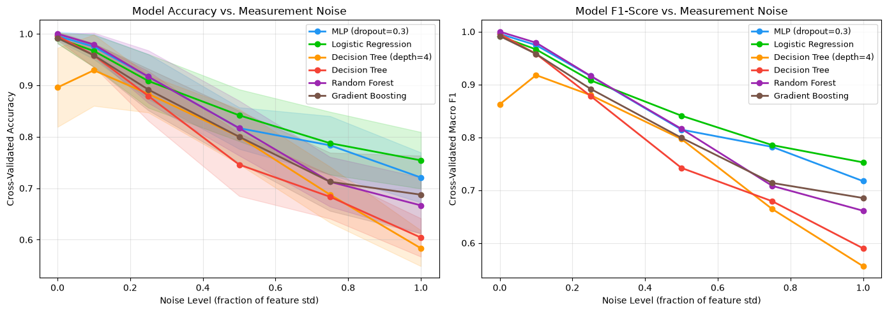
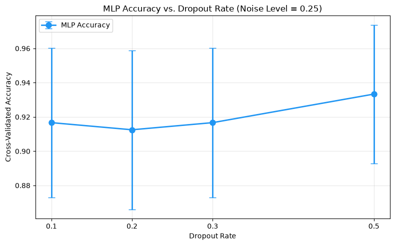
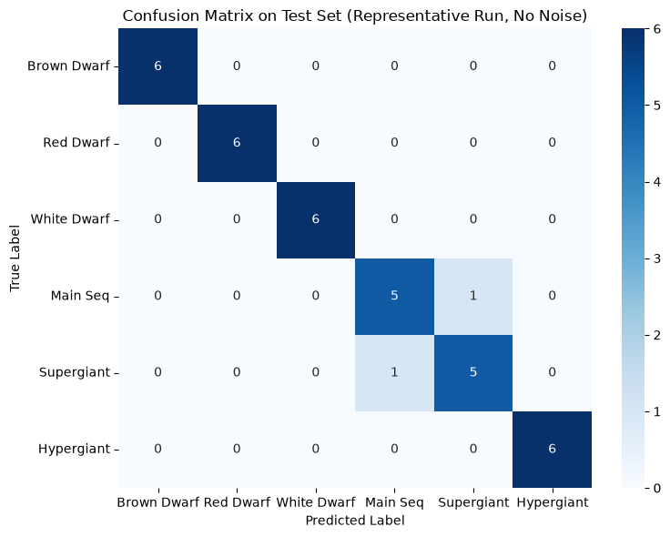

# Stellar Classification Comparative Analysis

A comparative study evaluating how different machine learning model classes respond to measurement noise when classifying stars into six astrophysical categories. The project uses a multilayer perceptron (MLP) implemented in PyTorch alongside logistic regression, two decision tree variants, and two ensemble methods (Random Forest and Gradient Boosting), evaluated across six Gaussian noise levels using 5-fold stratified cross-validation.

## Key Findings

- **Peak clean-data accuracy is misleading for model selection.** Random Forest achieved perfect accuracy (100%) on clean data, while the unconstrained decision tree reached 99.6%—but both collapsed under noise, with the decision tree dropping to 60.4% at maximum noise (a 39-point degradation).
- **Three distinct performance regimes emerged:** tree-based methods dominated clean data (Random Forest: 100%), the MLP and Random Forest co-led at moderate noise (91.7% at noise=0.25), and logistic regression prevailed under extreme perturbation (75.4% at maximum noise).
- The unconstrained decision tree's 39-point collapse (99.6% to 60.4%) confirmed that threshold-based models are particularly fragile under measurement uncertainty, while ensemble averaging partially mitigated this sensitivity.
- A dropout ablation revealed that the highest dropout rate (0.5) achieved marginally better accuracy (93.3%) than lighter regularization (91.7%), contrary to the original hypothesis—an artifact of checkpoint methodology resolved through principled final-epoch evaluation.
- No pairwise differences reached statistical significance (p ≥ 0.0625), reflecting limited power with 5-fold cross-validation.

## Visual Results


*Figure 1: Classification accuracy across six Gaussian noise levels (0.0–0.5). Error bars represent 5-fold CV standard deviation.*


*Figure 2: MLP accuracy versus dropout rate at noise level σ=0.25. Counterintuitively, dropout=0.5 outperformed lighter regularization (93.3% vs 91.7%).*


*Figure 2: Confusion matrix at moderate noise (σ=0.25), highlighting systematic misclassification between spectral subclasses.*

## Results at a Glance

| Model | Clean (σ=0.0) | σ=0.10 | σ=0.25 | σ=0.50 | σ=0.75 | σ=1.00 | Degradation |
|-------|--------------|--------|--------|--------|--------|--------|-------------|
| Random Forest | **100.0%** ± 0.0 | **97.9%** ± 2.3 | **91.7%** ± 5.1 | 81.7% ± 5.3 | 71.3% ± 4.8 | 66.7% ± 5.4 | 33.3 pp |
| MLP (PyTorch) | 99.6% ± 0.8 | 97.5% ± 2.4 | **91.7%** ± 4.4 | 81.7% ± 4.0 | 78.3% ± 5.7 | 72.1% ± 4.9 | 27.5 pp |
| Logistic Reg. | 99.2% ± 1.0 | 96.7% ± 3.1 | 90.8% ± 5.2 | **84.2%** ± 5.0 | **78.7%** ± 6.1 | **75.4%** ± 5.5 | 23.8 pp |
| DT (unconstrained) | 99.6% ± 0.8 | 95.8% ± 2.3 | 87.9% ± 4.8 | 74.6% ± 6.1 | 68.3% ± 4.2 | 60.4% ± 3.7 | 39.2 pp |
| DT (max_depth=4) | 89.6% ± 7.7 | 92.9% ± 6.9 | 88.3% ± 3.6 | 80.0% ± 5.4 | 68.8% ± 5.4 | 58.3% ± 3.5 | 31.3 pp |
| Gradient Boosting | 99.2% ± 1.0 | 95.8% ± 2.3 | 89.2% ± 4.0 | 80.0% ± 5.0 | 71.3% ± 5.7 | 68.7% ± 7.6 | 30.5 pp |

*Values are mean ± standard deviation across 5-fold stratified cross-validation. Bold indicates the leading model at each noise level.*

## Models Compared

| Model | Library |
|---|---|
| Multilayer Perceptron (64→32→6, ReLU, BatchNorm, Dropout=0.3) | PyTorch |
| Logistic Regression | scikit-learn |
| Decision Tree (unconstrained) | scikit-learn |
| Decision Tree (max_depth=4) | scikit-learn |
| Random Forest | scikit-learn |
| Gradient Boosting | scikit-learn |

## Dataset

240 samples with 6 features (4 numeric, 2 categorical) and 6 balanced target classes (Brown Dwarf, Red Dwarf, White Dwarf, Main Sequence, Supergiant, Hypergiant).

**Citation:**  
Deepu (2020). *Star dataset to predict star types* [Data set]. Kaggle. https://www.kaggle.com/datasets/deepu1109/star-dataset

## Methodology

- **Primary evaluation:** 5-fold stratified cross-validation
- **Noise injection:** Gaussian perturbation on numeric features, scaled proportionally to each feature's standard deviation
- **Two experiments:**
  1. Noise robustness sweep (6 levels × 6 models)
  2. Dropout ablation (4 rates × 1 noise level)
- **Diagnostics:** Representative 70-15-15 split for training curves, classification report, and confusion matrix

## Tech Stack


## Conclusion

Measurement noise in astronomical observations is not a theoretical nuisance—it's a daily reality. This study demonstrates that **peak clean-data accuracy is misleading for model selection** in scientific applications. Random Forest's 100% baseline masks its 33-point degradation under noise, while the unconstrained decision tree collapses 39 points (99.6% to 60.4%), confirming that threshold-based models are fragile under measurement uncertainty.

Logistic regression emerges as the most robust model, maintaining 75.4% accuracy at maximum noise (σ=1.0), outperforming the MLP (72.1%) by 3.3 percentage points. The three distinct performance regimes—trees dominate clean data, MLP competes at moderate noise, logistic regression prevails under extreme perturbation—demonstrate that optimal model selection depends critically on expected measurement uncertainty in deployment scenarios.

For astronomers selecting classification pipelines: prioritize noise robustness over peak performance, and validate with synthetic perturbations before trusting predictions on observational data.

## Getting Started

```bash
# Clone the repository
git clone https://github.com/brianurban/stellar-classification-comparative-analysis.git

# Install dependencies
pip install -r requirements.txt

# Run the notebook
jupyter notebook stellar_classification_comparative_analysis.ipynb
